# Off The Rail
> For those shopaholics out there ✧

View Off The Rail on [Heroku](https://offtherail.herokuapp.com/)

View Off The Rail on [GitHub Repo](https://github.com/indiaderrick/wdi-project-four)

'Off the rail' is a one-page MERN stack e-commerce/social media platform. Similar to the app 'Depop', users are able to buy and sell items, follow other users, and 'save for later' the items that they like (among other things). I used a maps API to integrate the sellers locations, and built an instant messaging component so that users can discuss sales and purchases.
___
## The Brief

*  Build a full-stack application by making your own backend and  front-end
*  Use an Express API to serve your data from a Mongo database
* Consume your API with a separate front-end built with React
* Be a complete product which most likely means multiple relationships and CRUD functionality for at least 2 models
* Implement thoughtful user stories/wireframes that are significant enough to help you know which features are core MVP and which you can cut
* Have a visually impressive design.
* Be deployed online so it's publicly accessible.
* Have automated tests for at least one RESTful resource on the back-end. Improve your employability by demonstrating a good understanding of testing principals.

## Technologies Used

* HTML
* SCSS, CSS
* Bulma
* JavaScript (ECMAScript 6)
* Node.js
* React.js
* Express
* MongoDB
* GitHub
* Git

## Approach Taken

### Wireframes
Several wireframes were put together on a site called MockFlow.

#### Home
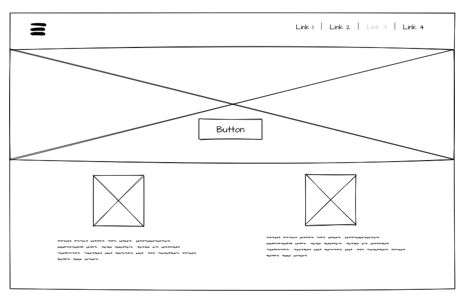


#### Index
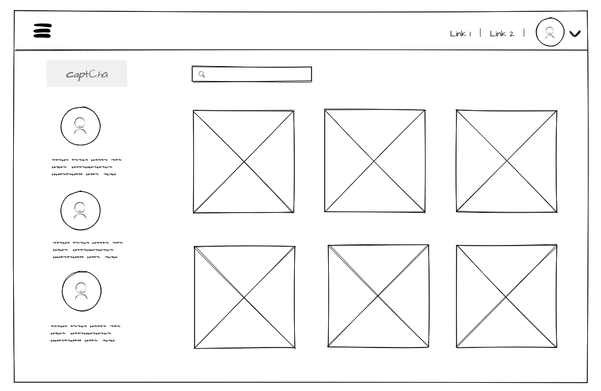


#### Item Show
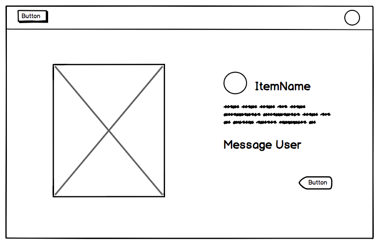


#### Profile Page
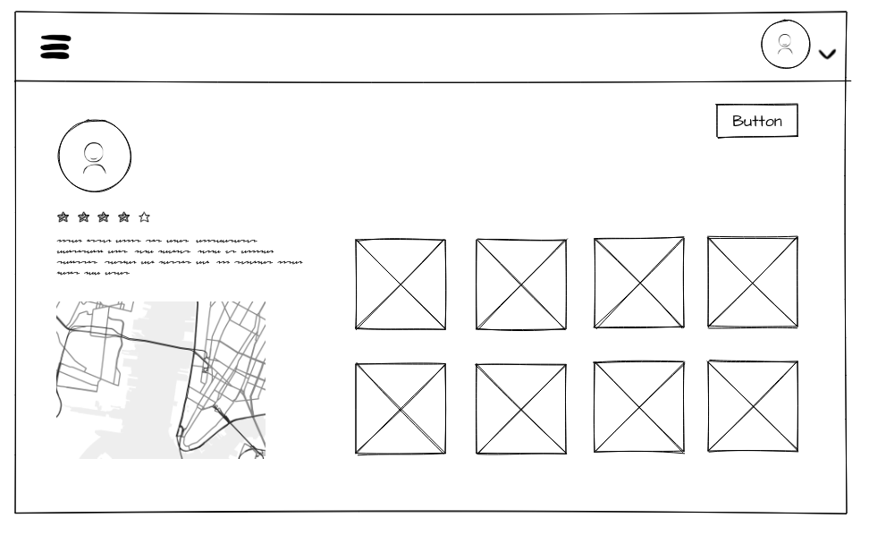

### Back End
I started with the back end, aiming to have this as strong and stable as possible so that it would do most of the work. Every route was tested in insomnia to check the correct data was being sent. I managed to get all this working in a couple of days, apart from the 'save for later' and 'message' components which I added later as these were not part of my MVP. I made sure to test a RESTful resource (Items) on the back end before I moved on.


## Featured Piece of Code 1
The backend architecture that related to my MVP was relatively simple and similar to what I had used in previous projects. Hence, I am choosing to show a section from my messaging component - an example of where I got the backend to do the work. In the controller function below, all messages that include the id of the currently logged in user's id (req.tokenUserId) are filtered for and sent to the front end. Rather than sending all of the messages to the front end and filtering there, this method only gathers messages that involve the current user.

From [./controllers/messageController.js](https://github.com/platypotomus/wdi-project4-orbital/blob/master/models/user.js). CHANGE LINK

```javascript
function indexRoute(req, res, next){
  Message
    .find({ $or: [{ from: req.tokenUserId }, { to: req.tokenUserId}] })
    .populate('from to', 'username name profilePicture')
    .sort('createdAt')
    .then(messages => res.json(messages))
    .catch(next);
}
```

### Front-End

The front end was built using React.js. As planned, I got the basic architectural component structure to a solid point, so that it was rendering the correct data in the correct places, after a couple of days. This allowed me time to move onto building a messaging component, adding extra features and concentrate on styling over the last couple of days of the project.

## Styling

With the styling, I left this until the very end and so did not get to spend as much time on it as I would have liked. Although I am happy with how it looks, my code could have been a lot more DRY. I chose to use SCSS for this project as I find its embedded structure very useful. In future projects I would like to dedicate more time to my styling so that I have a logically separated architecture of partials and use solid variables and classes. I chose to subtly use one colour (#f08b40) throughout my site to keep consistency and give it a more holistic feel. I also used one font (Playfair Display) throughout my site.

## Wins and Blockers

The message component was a huge win for me. I got this working solidly in the backend so that you could create messages and gather all of the messages that included the currently logged in user. The front end was what I found hardest - getting all of the messaging components to communicate with each other. However, this is where I felt I learn the most about React.js. I overcame this by having a main classical component that allowed the functional child components to communicate. Creating a new conversation thread with a user was also a blocker. I tackled this by having a NewMessage component which sent a POST request containing all of the necessary information to the database, and the conversation would then render on the messages page.

Another blocker that turned into a big win was that I chose to use one classical component for all users profiles (own & others). Although I still believe this is the best approach, I was presented with an issue when it came to rendering different user information. After noticing that the props changed but the information didn't, I released that I needed a componentDidUpdate that would gather the requested information if and when the current props were different to the previous props.

Styling was also a blocker for me as I left it all to the end. Although I think it is best to do the majority of styling after the functionality is there, I was left with so much information on each page that it was hard to organise. As a time saver, in future I think it would be more beneficial to get the basic structure implemented as I go along.

# Featured Piece of Code 2

This was the componentDidUpdate that I used to tackle the problem of rendering different profiles.

### Final Product

#### HOME
___
<p align="center">
  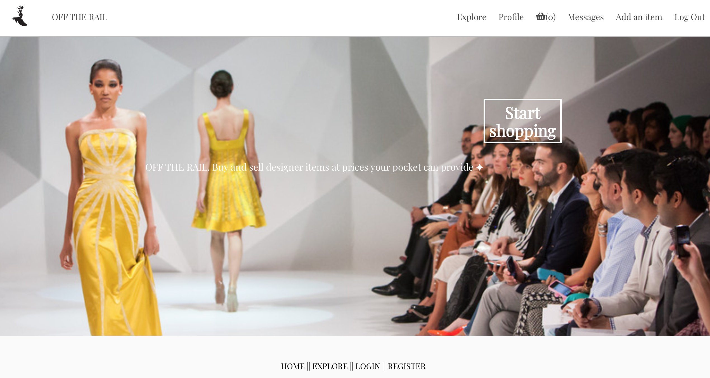
</p>

#### REGISTER
___
<p align="center">
  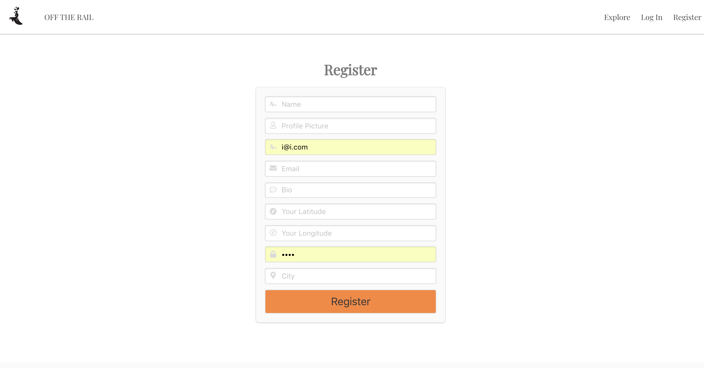
</p>

#### ITEM INDEX
___
<p align="center">
  
</p>


#### ITEM SHOW
___
<p align="center">
  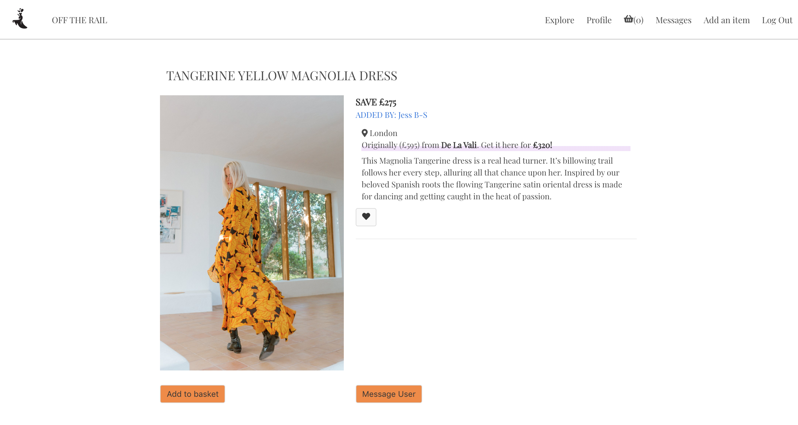
</p>


#### OWN PROFILE
___
<p align="center">
  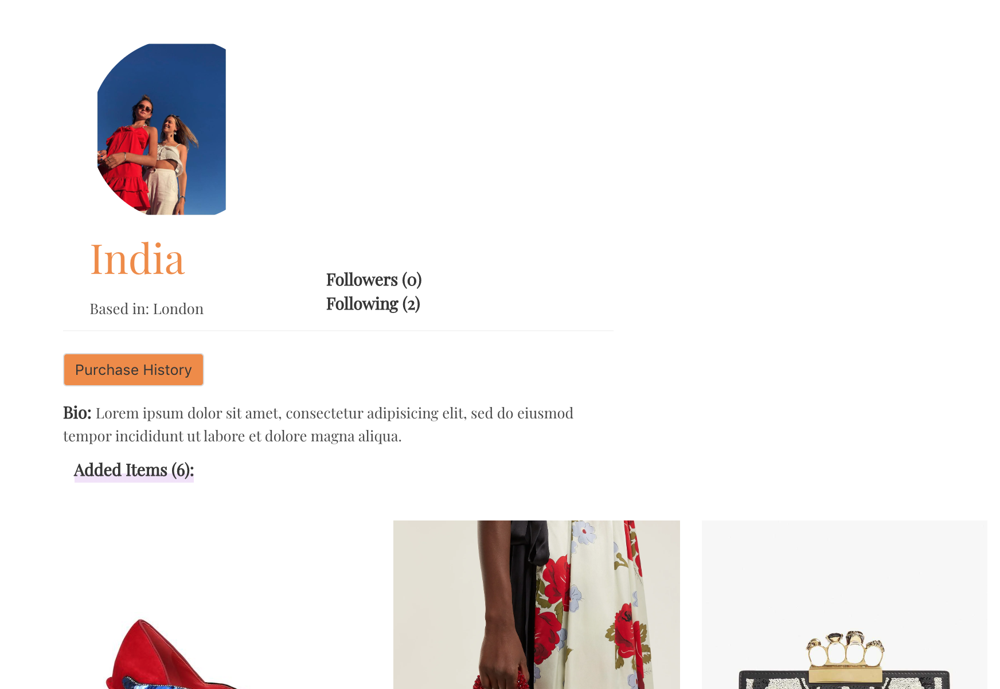
</p>

#### OTHER USERS PROFILE
___
<p align="center">
  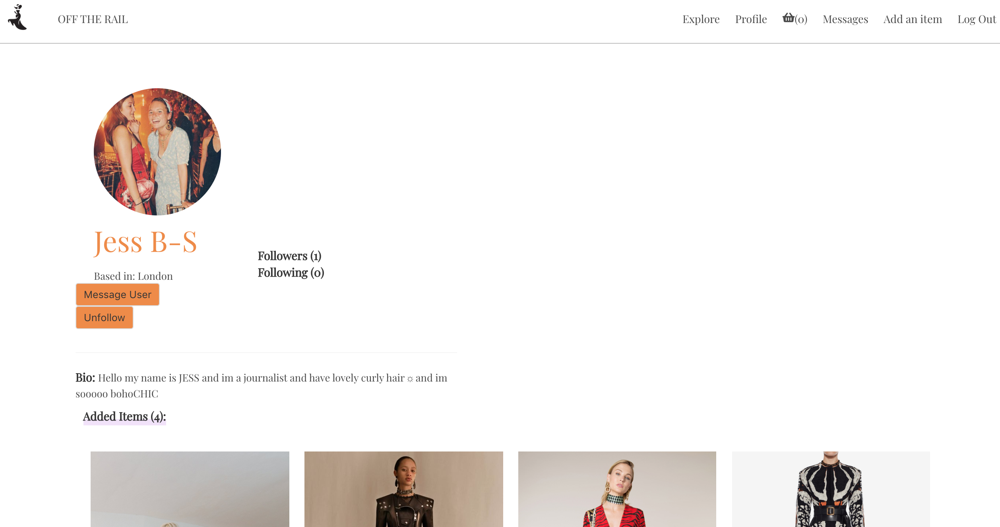
</p>

#### BASKET
___
<p align="center">
  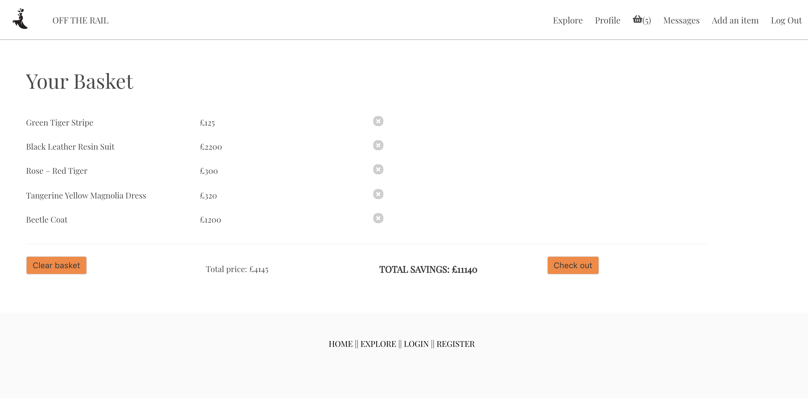
</p>

#### PURCHASE HISTORY
___
<p align="center">
  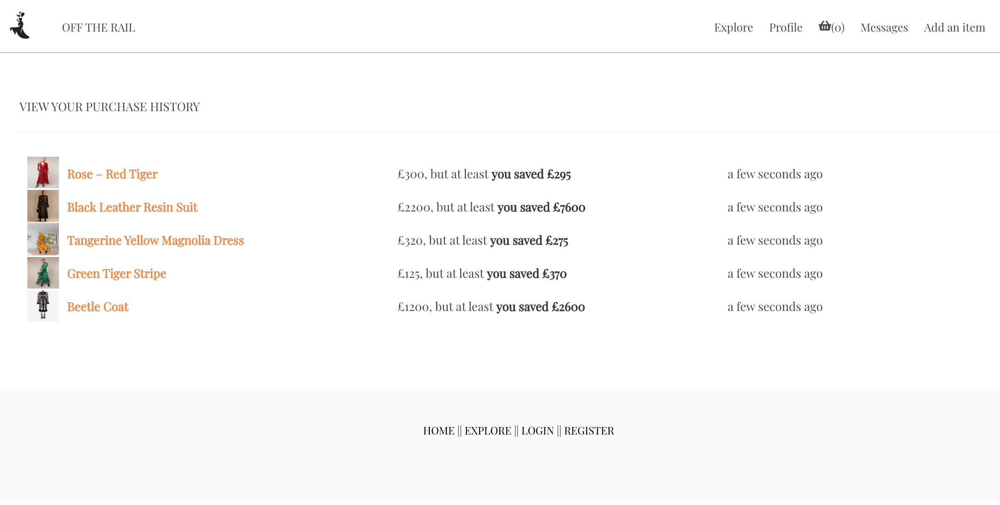
</p>

#### MESSAGES
___
<p align="center">
  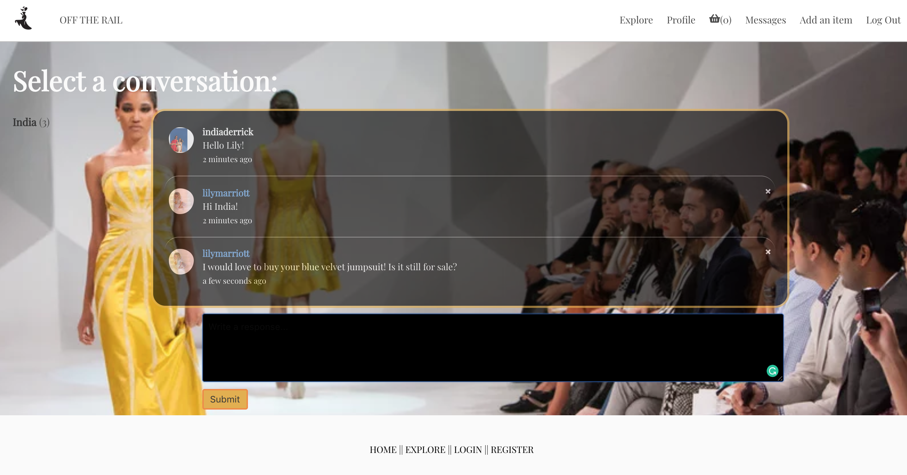
</p>


* HTML5
* SCSS
* JavaScript (ECMAScript 6)
* axios: v0.18.0
* babel-plugin-transform-class-properties: v6.24.1
* babel-plugin-transform-object-rest-spread: v6.26.0
* moment: v2.22.2
* react: v16.4.2
* react-dom: v16.4.2
* react-router-dom: v4.3.1
* react-leaflet: ^2.1.2
* Node.js
* MongoDB
* bcrypt: v3.0.0
* bulma: 0.7.1
* bluebird: v3.5.1
* body-parser: v1.18.3
* express: v4.16.3
* leaflet: 1.3.4
* jsonwebtoken: v8.3.0
* mongoose: v5.2.10
* morgan: v1.9.0
* request-promise: v4.2.2
* chai: v4.1.2
* mocha: v5.2.0
* supertest: v3.2.0
* Git
* GitHub
* Heroku
* Trello
* Google Fonts
* Fontawesome
